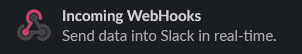
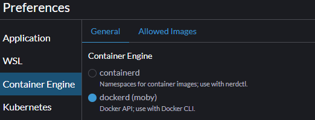

# Demo Observability App

This project demonstrates a basic observability stack, including Prometheus, Grafana, and Alertmanager, deployed on a local Kubernetes cluster. It's a simplified example intended for learning and experimentation.

## Description

The application provides a foundational setup for monitoring a Kubernetes environment. It uses Prometheus to collect metrics, Grafana to visualize them, and Alertmanager to generate alerts based on Prometheus rules.  The components are designed to work together to provide a comprehensive observability solution.

## Prerequisites

Before proceeding, ensure you have the following installed and configured:

*   **WSL (Windows Subsystem for Linux):**  This project suggests using a Linux environment within Windows.
*   **Rancher Desktop:** Rancher Desktop is highly recommended for managing the Kubernetes cluster and deploying applications on your local machine.
*   **Kubernetes CLI (kubectl):** You'll need the `kubectl` command-line tool to interact with the Kubernetes cluster. Ensure it's configured to connect to your local cluster. You can download and install `kubectl` from [https://kubernetes.io/docs/reference/kubectl/](https://kubernetes.io/docs/reference/kubectl/).
*   **K9s (Optional):** K9s is a terminal UI for Kubernetes. It simplifies managing your cluster.  You can install it from [https://k9s.io/](https://k9s.io/). While not strictly required, it's highly recommended for easier cluster management.

## Installation 

Before installation, make sure that your Rancher Desktop is running, and you can connect to the local cluster.

### Namespace

All resources are installed in the namespace called `monitoring`.

Create the namespace with kubectl: `kubectl apply -f templates/conf/namespace.yaml`

### Prometheus

1. Deploy the Prometheus configuration: `kubectl apply -f templates/conf/prometheus-config.yaml`
1. Deploy the Prometheus service account: `kubectl apply -f templates/sec/prometheus-sa.yaml`
1. Deploy the Prometheus rules: `kubectl apply -f templates/rules/prometheus-rules.yaml`
1. Deploy the Prometheus deployment: `kubectl apply -f templates/prometheus-deployment.yaml`
1. Deploy the Prometheus service: `kubectl apply -f templates/net/prometheus-service.yaml`

Prometheus can be then accessed locally on the [localhost:30000](http://localhost:30000) as its using NodePort service.

### Grafana

1. Deploy the Grafana datasource configuration: `kubectl apply -f templates/conf/grafana-datasource.yaml`
1. Deploy the Grafana deployment: `kubectl apply -f templates/grafana-deployment.yaml`
1. Deploy the Grafana service: `kubectl apply -f templates/net/grafana-service.yaml`

Grafana can be then accessed locally on the [localhost:32000](http://localhost:32000) as its using NodePort service.

### Alertmanager

> [!TIP]
> Firstly configure your [alert reciever](#alert-reciever-preparation) before Alertmanager installation.

1. Deploy the Alertmanager configuration: `kubectl apply -f templates/conf/alertmanager-datasource.yaml`
1. Deploy the Alertmanager deployment: `kubectl apply -f templates/alertmanager-deployment.yaml`
1. Deploy the Alertmanager service: `kubectl apply -f templates/net/alertmanager-service.yaml`

Grafana can be then accessed locally on the [localhost:31000](http://localhost:31000) as its using NodePort service.

## Configuration

### Prometheus Alerting rules

Modify the `rules/prometheus-rules.yaml` to add more alert rules based on the official [Alerting Rules](https://prometheus.io/docs/prometheus/latest/configuration/alerting_rules/) documentation. As the Prometheus is installed on the kubernetes cluster, the configuration must be inside ConfigMap to be mounted in the Prometheus deployment.

```yaml
groups:
  - name: [Group name]
    rules:
    - alert: [Alert name]
      expr: [PromQL expression]
      for: [Time period]
      labels:
        severity: [critical|warning|info]
      annotations:
        summary: [Summary or description of the alert]
```

> [!TIP]  
> Create alert groups for different components, or group alerts by monitoring purpose (eg. resources, traffic).

> [!NOTE]  
> Alert rules are using [Prometheus Query Languange](https://prometheus.io/docs/prometheus/latest/querying/basics/) for the evaluation expression. When defining alert expressions, the expression operator must be always used.

> [!IMPORTANT]  
> Prometheus deployment have to be rolled out to apply new alert configuration.


### Alert reciever preparation

The example application uses Slack channel as an alert destination (alert reciever). 

To configure your own Slack channes as a alert reciever, we need to prepare the slack channel and add a Webhook integration.

To create your Slack channel, follow those steps:
1. Register or Login to Slack.
1. Create your Slack team.
1. Create a dedicated channel to which the alerts will be delivered.

Now we add a Webhook integration to the channel:
1. In the channel setting, open `Integrations` tab.
1. Under `Integrations`, select `Add an App`.
1. In the Apps marketplace, search for `Incoming WebHooks` application.

    

1. Under the `Incoming WebHooks` Application configuration select the previously created channel dedicated for alert delivery.
1. Now the webook integration is added to the channel and we can retrieve `Webhook URL`.
1. Copy the `Webhook URL` and store ir for the following configuration of Alertmanager.

> [!NOTE]
> Visit official [Alertmanager configuration](https://prometheus.io/docs/alerting/latest/configuration/) to preview supported recievers.


### Alertmanager Configuration

Modify the `conf/alertmanager-config.yaml` configuration to configure an alert reciever. The example configuration uses Slack channel as an alert reciever. 

```yaml
global:
  resolve_timeout: 1m
  slack_api_url: '' # here goes your Slack API URL

route:
  receiver: 'slack-notifications'

receivers:
  - name: 'slack-notifications'
    slack_configs:
      - channel: '' # here goes your Slack channel name
        send_resolved: true 
```
> [!NOTE]
> Follow official [Alertmanager configuration](https://prometheus.io/docs/alerting/latest/configuration/) in case of configuration of other recievers (eg. Teams, Mail or generic webhook) should be configured.

> [!IMPORTANT]  
> Alertmanager deployment have to be rolled out to apply new configuration.

### Grafana 

> [!NOTE]
>
> Grafana can be accessed on [http://localhost:32000](http://localhost:3200). For the initial login, username and password are both "admin". After the login, a prompt to define a new admin password is displayed. Password is restarted with each restart of grafana pod as persistence is not enabled.

Prometheus datasource is already pre-configued in the `templates/conf/grafana-datasource.yaml`. In case the Prometheus would be installed to different namespace, or if it would use different container port, the datasource have to be adjusted.

To load already prepared dashboard, run folloing command:
```
kubectl apply -f templates/conf/grafana-dashboards.yaml
```

The `grafana-dashboards.yaml` contain the configuration of `grafana-dashboard-provider` and `grafana-dashboards`. The provider serves to discover dashboard configuration JSON in a filesystem and load it into Grafana itself.

---
## Custom Metric Development

### Demo flask application

#### Build the app

To run the demo flask application in the cluster, we firstly need to build the image:
1. Mavigate to the `resources/flask-demo-app` folder
1. Run build command: `docker build -t flask-demo-app:latest .`
  - you can set any image name or tag
  - in case the `latest` tag is used, the application deployment must have set `imagePullPolicy: Never`

> [!NOTE]
> Build can be done with either `docker` or `nerdctl`, this depents on the selected container runtime in Rancher desktop. Follow official Rancher desktop [Working with Images](https://docs.rancherdesktop.io/tutorials/working-with-images/) documentation for more.<br>
> 

#### Run & Test

1. Deploy the `flask-demo-app` Deployment: `kubectl apply -f templates/flask-app.yaml`
1. Navigate to the [Demo flask app](http://localhost:30081)
3. Demo application contains buttons which are adjusting metrics in the backend
  - Click button to increase counter metric
  - Toggle button to set a value to gauge metric
  - Demo application contains additional gauge metric which value is randomly set. 
  - Navigate to the [Demo App /metrics endpoint](http://localhost:30081/metrics) to preview raw metric data

Available metrics:
  - demo_app_random_values 
  - demo_app_clicks_total 
  - demo_app_enabled 

#### Metric scraping

The `prometheus-server-conf` aready contains configuration of the metric target defintion.

```yaml
- job_name: 'flask-demo-app'
  kubernetes_sd_configs:
    - role: endpoints
  scheme: http
  tls_config:
    insecure_skip_verify: true
  relabel_configs:
    - source_labels: [__meta_kubernetes_service_label_app]
      action: keep
      regex: flask-demo-app
    - source_labels: [__meta_kubernetes_namespace]
      action: keep
      regex: monitoring
```

> [!NOTE]
>
> In case the Prometheus operator would be installed, the ServiceMonitor or PodMonitor Custom Resource Definitions could be used instead.

## TODOS
- Pushgateway for ephemeral object monitoring
- Java demo application
- Grafana alerts & notification delivery'


